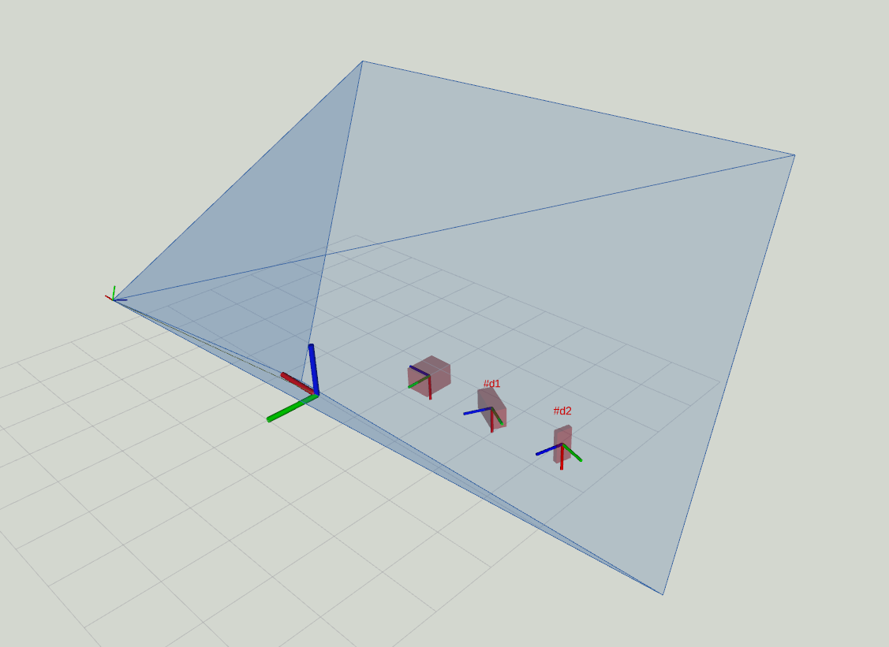

Display objects in [vision_msgs/msg/Detection3DArray](https://index.ros.org/p/vision_msgs) and the view frustum of [sensor_msgs/msg/CameraInfo](https://index.ros.org/p/sensor_msgs) in Rviz.

## License

This project is licensed as Apache 2.0, see LICENSE for additional information.

### Icon copyright

Detection3DArray Display icon taken from https://thenounproject.com/term/detection/3600444/ and optimized using svgo.

'detection' by sachin modgekar from the Noun Project, licensed as CCBY

CameraInfo Display icon taken from Rviz default icons https://github.com/ros2/rviz